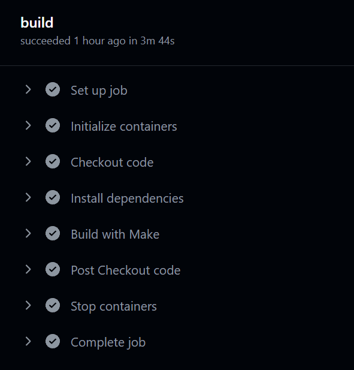
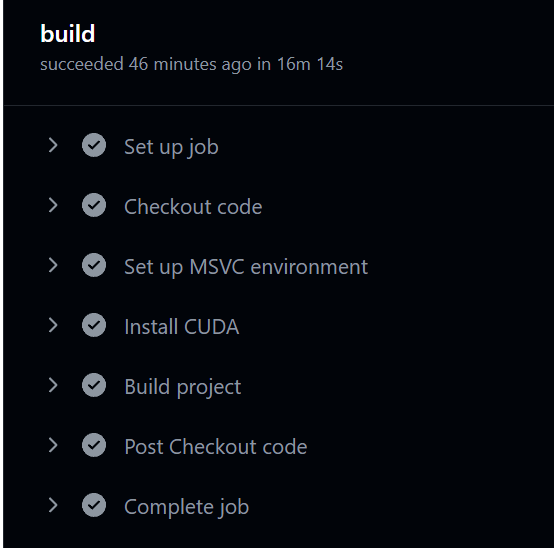

date: 2023-12-22 09:44:42

tags: cuda workflow github

## Ubuntu

```yaml
name: CUDA CI

on:
  pull_request:
    branches:
      - master  # 你可以根据需要调整分支

jobs:
  build:
    runs-on: ubuntu-latest
    container: 
      image: nvidia/cuda:11.2.2-devel-ubuntu20.04  # 使用适合你的CUDA版本的官方NVIDIA容器

    steps:
      - name: Checkout code
        uses: actions/checkout@v2

      - name: Install dependencies
        run: |
          apt-get update
          apt-get install -y build-essential

      - name: Build with Make
        run: cd src && make

```



## Windows

```yaml
name: CUDA CI on Windows

on:
  pull_request:
    branches:
      - master

jobs:
  build:
    runs-on: windows-2019

    steps:
    - name: Checkout code
      uses: actions/checkout@v2      
      
    - name: Set up MSVC environment
      uses: ilammy/msvc-dev-cmd@v1.13.0
      with:
        arch: x64
        vsversion: "2019"
      
    - name: Install CUDA      
      run: |
        choco install cuda --version=11.2.2.46133
        
    - name: Build project
      shell: cmd
      run: |
        set PATH=%PATH%;C:\Program Files\NVIDIA GPU Computing Toolkit\CUDA\v11.2\bin
        nvcc --version
        cd src && make


```

