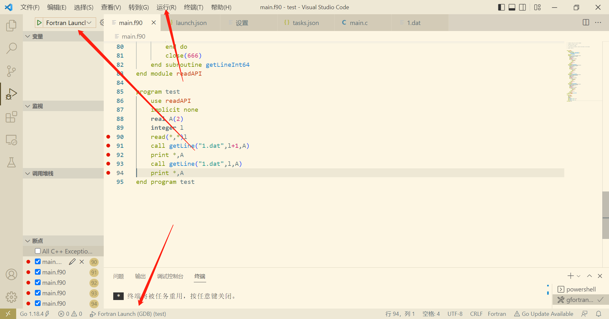

date: 2022-08-23 14:52:12

tags: vscode fortran debug

**please make sure you have gdb and gfortran**

* launch.json

  ```json
  {
      "version": "0.0.1",
      "configurations": [
          {
              "name": "Fortran Launch (GDB)",
              "type": "cppdbg",
              "request": "launch",
              "targetArchitecture": "x64",
              "program": "${workspaceRoot}\\${fileBasenameNoExtension}.exe",
              "miDebuggerPath": "D:\\cygwin64\\bin\\gdb.exe",
              "args": [],
              "stopAtEntry": false,
              "cwd": "${workspaceRoot}",
              "externalConsole": true,
              "preLaunchTask": "gfortran"
          }
      ] }
  ```

  "miDebuggerPath" insert your gdb full path.

* tasks.json

  ```json
  {
      "tasks": [
          {
              "label": "gfortran",
              "type": "shell",
              "command": "gfortran -o ${fileBasenameNoExtension}.exe  ${fileBasename} -g",
              "options": {
                  "cwd": "${workspaceFolder}"
              },
              "group": {
                  "kind": "build",
                  "isDefault": true
              }            
          },
    ],
      "version": "2.0.0"
  }
  ```

**configure finish**

## method of using



there are three or more ways to debug the example code.

you can also set some break points.

Wish you best.