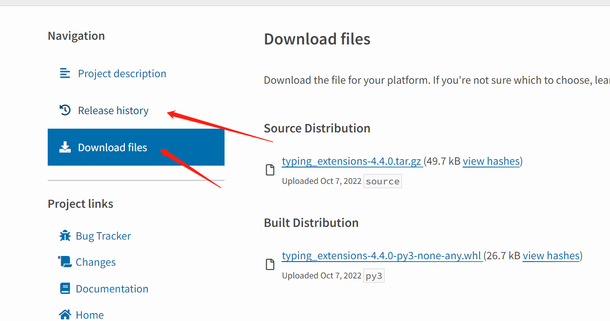
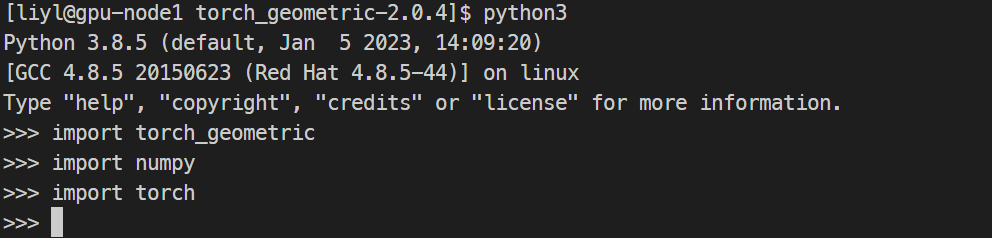

date: 2023-01-08 21:20:37

tags:

离线安装

> 若计算机中的python版本为Python 3.6.8，需要安装python3.8.5
>
> ` PyG is available for Python 3.7 to Python 3.10. `

### 安装Python3.8.5

https://www.python.org/downloads/release/python-385/

tar.xz文件解压命令 `tar xf`

进入解压后的文件，执行安装三部曲

```shell
./configure --prefix=${HOME}/Python3.8.5
make
make install
```

修改.bashrc，这次不但要添加python目录到python，还需要加alias将/usr/bin/下的python3屏蔽

```bash
#Python-3.8.5
export PATH=$PATH:${HOME}/Python3.8.5/bin
alias python3=${HOME}/Python3.8.5/bin/python3
```

检查版本

```shell
[liyl@gpu-node1 ~]$ python3
Python 3.8.5 (default, Jan  5 2023, 14:09:20) 
[GCC 4.8.5 20150623 (Red Hat 4.8.5-44)] on linux
Type "help", "copyright", "credits" or "license" for more information.
>>>
```

### 安装wheel

```bash
pip3 install wheel-0.37.1-py2.py3-none-any.whl --user
```


### 安装numpy 

https://pypi.org/project/numpy/1.23.5/#files
numpy-1.23.5-cp38-cp38-manylinux_2_17_x86_64.manylinux2014_x86_64.whl

安装包已经放到文档目录

```bash
python3 -m pip install numpy-1.23.5-cp38-cp38-manylinux_2_17_x86_64.manylinux2014_x86_64.whl --user
```


--user： 安装到用户目录，不需要sudo权限，安装位置为**./.local/lib/python3.8/site-packages**

### 安装typing_extensions

```bash
python3 -m pip install typing_extensions-4.4.0-py3-none-any.whl --user
```


### 安装pyTorch

http://download.pytorch.org/whl/torch_stable.html

torch-1.13.1+cpu-cp38-cp38-linux_x86_64.whl

```bash
python3 -m pip install torch-1.13.1+cpu-cp38-cp38-linux_x86_64.whl --user
```


### 注意事项

***安装要注意先后关系***

如果给你的安装包无法安装numpy或是pyTorch，首先检查python版本和主机所属平台，可以通过以下python代码实现查询

```bash
python3 -m pip debug --verbose
```

我的运行结果：

```
Compatible tags: 87
  cp38-cp38-manylinux2014_x86_64
  cp38-cp38-manylinux2010_x86_64
  cp38-cp38-manylinux1_x86_64
  cp38-cp38-linux_x86_64
  cp38-abi3-manylinux2014_x86_64
  cp38-abi3-manylinux2010_x86_64
  cp38-abi3-manylinux1_x86_64
  cp38-abi3-linux_x86_64
  cp38-none-manylinux2014_x86_64
  cp38-none-manylinux2010_x86_64
  cp38-none-manylinux1_x86_64
  cp38-none-linux_x86_64
  cp37-abi3-manylinux2014_x86_64
  cp37-abi3-manylinux2010_x86_64
  cp37-abi3-manylinux1_x86_64
  cp37-abi3-linux_x86_64
  cp36-abi3-manylinux2014_x86_64
  cp36-abi3-manylinux2010_x86_64
  cp36-abi3-manylinux1_x86_64
  cp36-abi3-linux_x86_64
  cp35-abi3-manylinux2014_x86_64
  cp35-abi3-manylinux2010_x86_64
  cp35-abi3-manylinux1_x86_64
  cp35-abi3-linux_x86_64
  cp34-abi3-manylinux2014_x86_64
  cp34-abi3-manylinux2010_x86_64
  cp34-abi3-manylinux1_x86_64
  cp34-abi3-linux_x86_64
  cp33-abi3-manylinux2014_x86_64
  cp33-abi3-manylinux2010_x86_64
  cp33-abi3-manylinux1_x86_64
  cp33-abi3-linux_x86_64
  cp32-abi3-manylinux2014_x86_64
  cp32-abi3-manylinux2010_x86_64
  cp32-abi3-manylinux1_x86_64
  cp32-abi3-linux_x86_64
  py38-none-manylinux2014_x86_64
  py38-none-manylinux2010_x86_64
  py38-none-manylinux1_x86_64
  py38-none-linux_x86_64
  py3-none-manylinux2014_x86_64
  py3-none-manylinux2010_x86_64
  py3-none-manylinux1_x86_64
  py3-none-linux_x86_64
  py37-none-manylinux2014_x86_64
  py37-none-manylinux2010_x86_64
  py37-none-manylinux1_x86_64
  py37-none-linux_x86_64
  py36-none-manylinux2014_x86_64
  py36-none-manylinux2010_x86_64
  py36-none-manylinux1_x86_64
  py36-none-linux_x86_64
  py35-none-manylinux2014_x86_64
  py35-none-manylinux2010_x86_64
  py35-none-manylinux1_x86_64
  py35-none-linux_x86_64
  py34-none-manylinux2014_x86_64
  py34-none-manylinux2010_x86_64
  py34-none-manylinux1_x86_64
  py34-none-linux_x86_64
  py33-none-manylinux2014_x86_64
  py33-none-manylinux2010_x86_64
  py33-none-manylinux1_x86_64
  py33-none-linux_x86_64
  py32-none-manylinux2014_x86_64
  py32-none-manylinux2010_x86_64
  py32-none-manylinux1_x86_64
  py32-none-linux_x86_64
  py31-none-manylinux2014_x86_64
  py31-none-manylinux2010_x86_64
  py31-none-manylinux1_x86_64
  py31-none-linux_x86_64
  py30-none-manylinux2014_x86_64
  py30-none-manylinux2010_x86_64
  py30-none-manylinux1_x86_64
  py30-none-linux_x86_64
  cp38-none-any
  py38-none-any
  py3-none-any
  py37-none-any
  py36-none-any
  py35-none-any
  py34-none-any
  py33-none-any
  py32-none-any
  py31-none-any
  py30-none-any
```

根据你的打印内容选择受支持的离线安装包

https://pypi.org/project/  在这里根据包名查包



### 对numpy和torch进行简单调用

```python
import torch as t
import numpy as n
a1 = t.ones(3,3)
a2 = t.ones(3,3)
b1 = n.ones((3,3))
b2 = n.ones((3,3))
print(a1+a2)
print(b1+b2)
```

输出

```shell
[liyl@gpu-node1 torch]$ python3 test.py 
tensor([[2., 2., 2.],
        [2., 2., 2.],
        [2., 2., 2.]])
[[2. 2. 2.]
 [2. 2. 2.]
 [2. 2. 2.]]
```

### pyG

>  pytorch-geometric简称pyG

https://pytorch-geometric.com/whl/torch-1.13.0%2Bcpu.html

检索需要的版本

安装其他依赖：

```bash
python3 -m pip install --user torch_scatter-2.1.0+pt113cpu-cp38-cp38-linux_x86_64.whl 
python3 -m pip install --user scipy-1.10.0-cp38-cp38-manylinux_2_17_x86_64.manylinux2014_x86_64.whl
python3 -m pip install --user torch_cluster-1.6.0+pt113cpu-cp38-cp38-linux_x86_64.whl
python3 -m pip install --user torch_sparse-0.6.16+pt113cpu-cp38-cp38-linux_x86_64.whl
python3 -m pip install --user torch_spline_conv-1.2.1+pt113cpu-cp38-cp38-linux_x86_64.whl
python3 -m pip install --user tqdm-4.64.1-py2.py3-none-any.whl
python3 -m pip install --user pytz-2022.7-py2.py3-none-any.whl
python3 -m pip install --user six-1.16.0-py2.py3-none-any.whl
python3 -m pip install --user python_dateutil-2.8.2-py2.py3-none-any.whl
python3 -m pip install --user pandas-1.5.2-cp38-cp38-manylinux_2_17_x86_64.manylinux2014_x86_64.whl
python3 -m pip install --user MarkupSafe-2.1.1-cp38-cp38-manylinux_2_17_x86_64.manylinux2014_x86_64.whl
python3 -m pip install --user Jinja2-3.1.2-py3-none-any.whl
python3 -m pip install --user certifi-2022.12.7-py3-none-any.whl
python3 -m pip install --user charset_normalizer-2.1.1-py3-none-any.whl
python3 -m pip install --user urllib3-1.26.13-py2.py3-none-any.whl
python3 -m pip install --user idna-3.4-py3-none-any.whl
python3 -m pip install --user requests-2.28.1-py3-none-any.whl
python3 -m pip install --user pyparsing-3.0.9-py3-none-any.whl
python3 -m pip install --user joblib-1.2.0-py3-none-any.whl
python3 -m pip install --user threadpoolctl-3.1.0-py3-none-any.whl
python3 -m pip install --user scikit_learn-1.2.0-cp38-cp38-manylinux_2_17_x86_64.manylinux2014_x86_64.whl
```

+ 从源码安装torch-geometric

  pyG镜像链接

https://mirrors.aliyun.com/pypi/simple/torch-geometric

```shell
cd torch_geometric-2.0.4
python3 -m pip install . --user
```

测试能否导入成功

