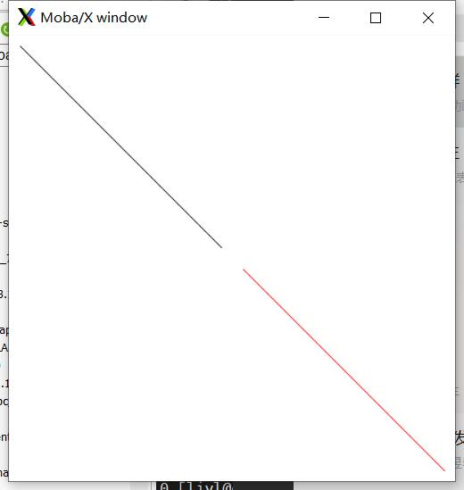

date: 2022-11-27 11:11:18

tags: x11 xorg

```c
#include <X11/Xlib.h>
#include <stdlib.h>
#include <stdio.h>
#include <unistd.h>
int main()
{
    Display *dsp = XOpenDisplay(NULL);
    if (!dsp)
    {
        return 1;
    }
    int screenNumber = DefaultScreen(dsp);
    unsigned long white = WhitePixel(dsp, screenNumber);
    unsigned long black = BlackPixel(dsp, screenNumber);

    Window win = XCreateSimpleWindow(dsp,
                                     DefaultRootWindow(dsp), //parent
                                     50, 50,   // origin point
                                     400, 400, // size
                                     0, black, // border width and color
                                     white);   // backgd
    XMapWindow(dsp, win);
    Colormap screen_colormap = DefaultColormap(dsp, DefaultScreen(dsp));
    XColor red;
    int rc = XAllocNamedColor(dsp, screen_colormap, "red", &red, &red);
    // alloc color 'red' by its name
    if (rc == 0)
    {
        fprintf(stderr, "XAllocNamedColor - failed to allocated 'red' color.\n");
        exit(1);
    }

    GC gc = XCreateGC(dsp, win, 0, NULL);
    XSetForeground(dsp, gc, black);
    XDrawLine(dsp, win, gc, 10, 10, 190, 190); //draw a line with color black
    XFlush(dsp);
    sleep(1);
    XSetForeground(dsp, gc, red.pixel); // change color for next draw
    XDrawLine(dsp, win, gc, 210, 210, 390, 390); //draw a line with color red
    XFlush(dsp);
    getchar(); // shutdown key
    XDestroyWindow(dsp, win);
    XCloseDisplay(dsp);
    return 0;
}

```

  