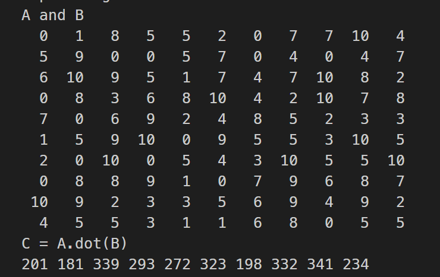

date: 2023-03-30 15:26:14

tags: SACA FORTRAN CRTS


### 主核代码 main.f90

```fortran
program main
    use utility
    implicit none
    integer :: i, j
    integer :: N = 10
    integer, pointer :: matrix_A(:,:)
    integer, pointer :: vector_B(:)
    integer, pointer :: vector_C(:)
    type(ParaType)::para
    integer, external :: slave_func
    allocate(matrix_A(N,N), vector_B(N), vector_C(N))
    para%N = N
    para%matrix_A => matrix_A
    para%vector_B => vector_B
    para%vector_C => vector_C
    print *, "A and B"
    do i = 1, N
        do j = 1, N
            matrix_A(j,i) = floor(11*rand())
            write(*, "(I4)", advance="no") matrix_A(j,i)
        end do
        vector_B(i) = floor(11*rand())
        write(*, "(I4)", advance="no") vector_B(i)
        print *
    end do
    call CRTS_Init()
    call CRTS_athread_spawn(slave_func, para)
    call CRTS_athread_join()
    print *, "C = A.dot(B)"
    do i = 1, N
        write(*, "(I4)", advance="no") vector_C(i)
    end do
    print *
end program main
```

### 工具模块 utility.f90

```fortran
module utility
    implicit none
    type, public :: ParaType
        integer :: N
        integer,pointer :: matrix_A(:,:)
        integer,pointer :: vector_B(:)
        integer,pointer :: vector_C(:)
    end type ParaType
interface
    integer function CRTS_smng_get_tid()
    end function CRTS_smng_get_tid
end interface
contains
end module utility
```

### 从核代码 slave.f90

```fortran
subroutine slave_func(para)
    use utility
    implicit none
    type(ParaType), intent(in) :: para
    integer :: N
    integer, pointer :: matrix_A(:,:)
    integer, pointer :: vector_B(:)
    integer, pointer :: vector_C(:)
    integer :: i, j
    integer :: myid
    integer :: tmp
    myid = CRTS_smng_get_tid()
    N = para%N
    if(myid < N) then
        matrix_A => para%matrix_A
        vector_B => para%vector_B
        vector_C => para%vector_C
        tmp = 0
        do i = 1,N
            tmp = tmp + matrix_A(i, myid+1) * vector_B(i)
        end do
        vector_C(myid+1) = tmp
    end if
end subroutine slave_func
```

### Makefile

```makefile
FC = swgfortran
main: main.o slave.o utility.o
	$(FC) -mhybrid $^ -o $@
main.o: main.f90 utility.o
	$(FC) -mhost -c $<
slave.o: slave.f90 utility.o
	$(FC) -mslave -c slave.f90
utility.o: utility.f90
	$(FC) -c $<
run:
	bsub -I -b -q q_linpack -cgsp 64 -n 1 ./main
clean:
	rm -rf *.o main *.mod
```

### 程序输出

